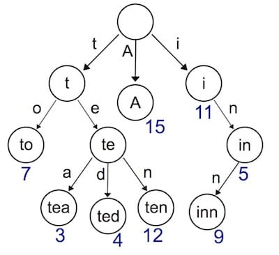
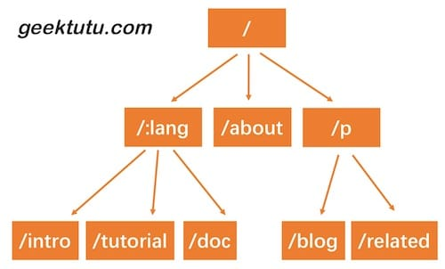

### 第一天

1.http基础，简单介绍net/http库及http.Handler接口
2.搭建Geeb框架雏形。

### 第二天 

#### 一、上下文Context

1. 将路由(router)独立出来，方便之后增强
2. 设计上下文(Context)，封装Request和Response，提供对JOSN、HTML等返回类型的支持。
3. 设计Context分析：

- a. 对web服务来说，无非是根据请求*http.Request，构造响应http.ResponseWriter。但是两个对象提供的接口粒度太细，比如我们要构造一个完整的响应，需要考虑消息头(Header)和消息体（Body),而Header包含了状态码(StatusCode)，消息类型(ContentType)等几乎每次请求都需要设置的信息。因此，如果不进行有效的封装，那么框架的用户将需要写大量重复，繁杂的代码，而且容易出错。针对常用场景，能够高效地构造出 HTTP 响应是一个好的框架必须考虑的点。

用返回 JSON 数据作比较，感受下封装前后的差距。
```go 
封装前：
obj = map[string]interface{}{
    "name": "geektutu",
    "password": "1234",
}
w.Header().Set("Content-Type", "application/json")
w.WriteHeader(http.StatusOK)
encoder := json.NewEncoder(w)
if err := encoder.Encode(obj); err != nil {
    http.Error(w, err.Error(), 500)
}
```

```go 
封装后：
c.JSON(http.StatusOK, gee.H{
    "username": c.PostForm("username"),
    "password": c.PostForm("password"),
})
```
- b.针对使用场景，封装*http.Request和http.ResponseWriter的方法，简化相关接口的调用，只是设计 Context 的原因之一。对于框架来说，还需要支撑额外的功能。例如，将来解析动态路由/hello/:name，参数:name的值放在哪呢？再比如，框架需要支持中间件，那中间件产生的信息放在哪呢？Context 随着每一个请求的出现而产生，请求的结束而销毁，和当前请求强相关的信息都应由 Context 承载。因此，设计 Context 结构，扩展性和复杂性留在了内部，而对外简化了接口。路由的处理函数，以及将要实现的中间件，参数都统一使用Context 实例， Context 就像一次会话的百宝箱，可以找到任何东西。


#### 二、 路由(Router)

- 我们将和路由相关的方法和结构提取了出来，放到了一个新的文件中router.go，方便我们下一次对 router 的功能进行增强，例如提供动态路由的支持。router 的 handle 方法作了一个细微的调整，即 handler 的参数，变成了 Context。


### 第三天

1. 使用Trie树实现动态路由（dynamic route）解析
2. 支持两种模式：name和 *filepath

#### 一、Trie树简介

之前，我们用了一个非常简单的map结构存储了路由表，使用map存储键值对，索引非常高效，但是有一个弊端，键值对的存储的方式，只能用来索引静态路由。那如果我我们想支持类似于 /hello/:name 这样的动态路由怎么办呢？所谓动态路由，即由一条路由规则可以匹配某一类型而非某一条固定的路由。例如：/hello/:name ，可以匹配 /hello/geektutu、/hello/jack等。

动态路由有很多种实现方式，支持的规则、性能等有很大的差异。例如开源的路由实现gorouter支持在路由规则中嵌入正则表达式，例如：/p/[0-9A-Za-z]+ ，即路径中的参数仅匹配数字和字母；另一个开源实现httprouter就不支持正则表达式。著名的Web开源框架gin在早期的版本，并没有实现自己的路由，而是直接使用了httprouter，后来不知道什么原因，放弃了httprouter，自己实现了一个版本。



实现动态路由最常用的数据结构，被称为前缀树（Trie树）。

每一个节点的所有的子节点都拥有相同的前缀，这种结构非常适用于路由匹配，比如定义了如下规则：

- /:lang/doc
- /:lang/tutorial
- /:lang/intro
- /about
- /p/blog
- /p/related

用前缀树表示是这样的：


HTTP请求的路径恰好是由 / 分隔的多段构成的，因此，每一段可以作为前缀树的一个节点。我们通过数结构查询，如果中间某一层的节点都不满足条件，那么就说明没有匹配到的路由，查询结束。

接下来我们实现的动态路由具备以下两个功能：

- 参数匹配： 例如 /p/:lang/doc，可以匹配 /p/c/doc 和 /p/go/doc。
- 通配*：例如：/static/*filepath，可以匹配 /static/fav.ico，也可以匹配 /static/js/jQuery.js，这种模式常用于静态服务器，能够递归的匹配子路径。

#### 二、 Trie树实现